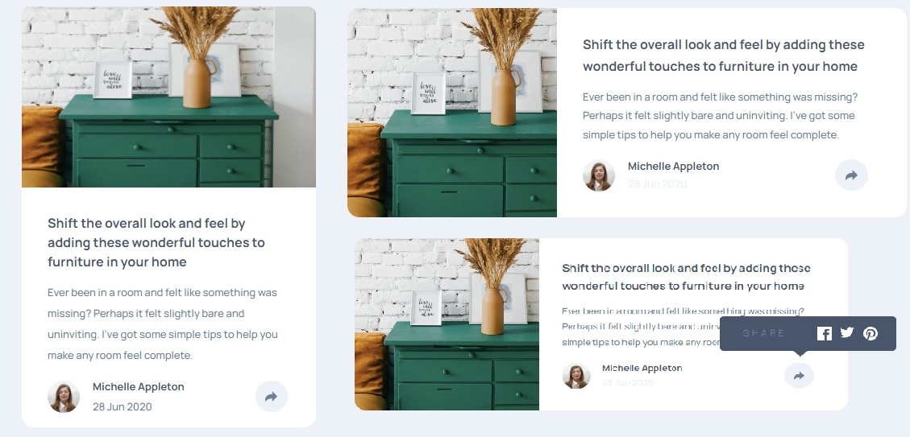

# Frontend Mentor - Article preview component solution

This is a solution to the [Article preview component challenge on Frontend Mentor](https://www.frontendmentor.io/challenges/article-preview-component-dYBN_pYFT). Frontend Mentor challenges help you improve your coding skills by building realistic projects.

## Table of contents

- [Overview](#overview)
  - [The challenge](#the-challenge)
  - [Screenshot](#screenshot)
  - [Links](#links)
  - [Built with](#built-with)
  - [What I learned](#what-i-learned)
- [Author](#author)

## Overview

This is a challenge from Frontend-Mentor. The purpose of this challenge is to improve my skills with JS.

### The challenge

Users should be able to:

- View the optimal layout for the component depending on their device's screen size
- See the social media share links when they click the share icon

### Screenshot



### Links

- Solution URL: [GitHub](https://github.com/PaulaR-05/Article-preview-component)
- Live Site URL: [site URL](https://paular-05.github.io/Article-preview-component/)

### Built with

- Semantic HTML5 markup
- CSS custom properties
- Flexbox
- CSS Grid
- Javascript

### What I learned 🏆

```js
const button = document.querySelector(".share-icon");
const socialH = document.querySelector(".social");
const shareIconTwo = document.querySelector(".triangulo-para-baixo");

button.addEventListener("click", submit);

function submit() {
  if (socialH.classList.contains("hidden")) {
    socialH.classList.remove("hidden");
    shareIconTwo.classList.remove("hidden");
  } else {
    socialH.classList.add("hidden");
    shareIconTwo.classList.add("hidden");
  }
}
```

## Author

- GitHub - [@PaulaR-05](https://github.com/PaulaR-05)
